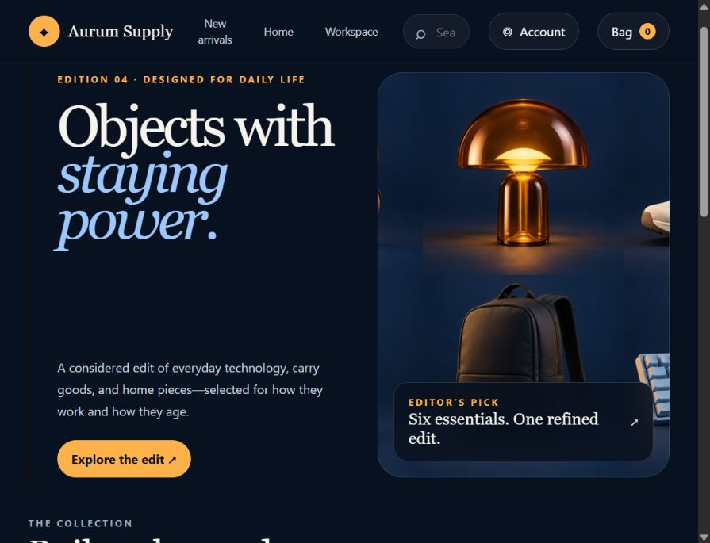
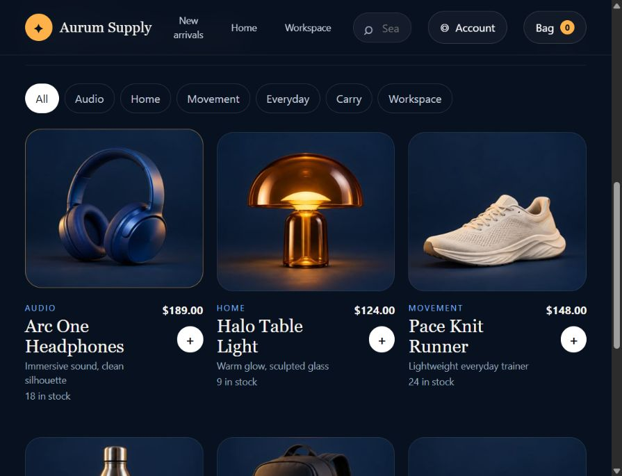

# Aurum Supply

<p align="center">
  <strong>A polished, full-stack ecommerce storefront for considered everyday objects.</strong>
</p>

<p align="center">
  <a href="https://aurum-supply-shop.abinayaselvaraj3504.chatgpt.site">Live Demo</a>
  ·
  <a href="#features">Features</a>
  ·
  <a href="#local-development">Local Development</a>
  ·
  <a href="#api-reference">API Reference</a>
</p>



## Overview

Aurum Supply is a responsive ecommerce application that combines an editorial storefront with the workflows expected from a real online shop. Customers can discover products, manage a cart, complete checkout, and track orders. Administrators can manage inventory and update fulfillment status from the same application.

The production deployment uses a Cloudflare Worker and D1 database. The interface is delivered without a client framework dependency, keeping the deployment small and fast.

## Live Demo

**[Open Aurum Supply](https://aurum-supply-shop.abinayaselvaraj3504.chatgpt.site)**

The hosted demo is private and requires sign-in. The first authenticated user is promoted to the administrator role; subsequent users receive the standard customer role.

## Features

### Storefront

- Responsive editorial product catalog
- Product search and category filters
- Inventory visibility
- Shopping bag with quantity controls
- Accessible drawer and modal interactions
- Desktop and mobile layouts

### Checkout and Orders

- Validated shipping form
- Server-calculated order totals
- Inventory checks during checkout
- Atomic order, order-item, and stock updates
- Customer order history
- Fulfillment states: processing, packed, shipped, and delivered

### Authentication and Authorization

- Identity-aware sessions from authenticated request headers
- Automatic first-user administrator bootstrap
- Server-side authorization for every management endpoint
- Separate Admin and User capabilities

### Administration

- Create products
- Edit pricing, descriptions, categories, and inventory
- Remove products from the active catalog
- Review all orders
- Update order status

### Agent-Friendly Interaction

- WebMCP catalog search tool
- WebMCP add-to-cart tool
- Structured, concise action results

## Product Catalog



## Architecture

```text
Browser
  ├── Storefront, cart, checkout, account, and admin UI
  ├── WebMCP tools
  └── JSON API requests
         │
Cloudflare Worker
  ├── Authentication and role checks
  ├── Product management API
  ├── Checkout and inventory transactions
  └── Order tracking API
         │
Cloudflare D1
  ├── users
  ├── products
  ├── orders
  └── order_items
```

## Technology

- JavaScript ES modules
- Cloudflare Workers
- Cloudflare D1 / SQLite
- HTML5 and modern CSS
- Browser Fetch API
- WebMCP

## Project Structure

```text
.
├── .openai/
│   └── hosting.json
├── db/
│   └── schema.ts
├── docs/
│   └── images/
├── drizzle/
│   ├── 0000_aurum_store.sql
│   └── meta/
├── scripts/
│   ├── build.mjs
│   └── validate-artifact.mjs
├── worker/
│   └── index.js
└── package.json
```

## Database

The D1 migration creates four related tables:

| Table | Purpose |
| --- | --- |
| `users` | Authenticated identities and roles |
| `products` | Catalog data, prices, stock, and visibility |
| `orders` | Customer, shipping, total, and fulfillment state |
| `order_items` | Immutable product snapshots for each order |

Indexes cover catalog filtering, customer order history, fulfillment queues, and order-item lookups.

## Local Development

### Requirements

- Node.js 22 or newer
- A Worker-compatible runtime for full D1 integration

### Build and Validate

```bash
npm run build
npm run validate
```

The build produces a deployable Worker artifact under `dist/`.

### Database Migration

Apply the migration in `drizzle/0000_aurum_store.sql` to the configured D1 database before starting the application.

## API Reference

| Method | Endpoint | Access | Description |
| --- | --- | --- | --- |
| `GET` | `/api/session` | Signed in | Returns the current user and role |
| `GET` | `/api/products` | User | Lists active catalog products |
| `POST` | `/api/products` | Admin | Creates a product |
| `PATCH` | `/api/products/:id` | Admin | Updates a product |
| `DELETE` | `/api/products/:id` | Admin | Removes a product from the active catalog |
| `GET` | `/api/orders` | User/Admin | Lists owned orders or all orders |
| `POST` | `/api/orders` | User | Creates an order and updates inventory |
| `PATCH` | `/api/orders/:id` | Admin | Updates fulfillment status |

## Security Notes

- Prices and totals are calculated on the server.
- Inventory is revalidated during checkout.
- Management actions require server-side administrator authorization.
- Product queries use prepared statements.
- The demo checkout does not collect or process payment-card information.

## Verification

The project includes checks for:

- Worker module validity
- HTML and client-side JavaScript parsing
- Product image delivery
- Catalog seeding
- Role bootstrap and admin authorization
- Product creation, editing, and removal
- Checkout totals and inventory updates
- Order creation and status tracking

## License

This project is provided for learning, demonstration, and portfolio use.

